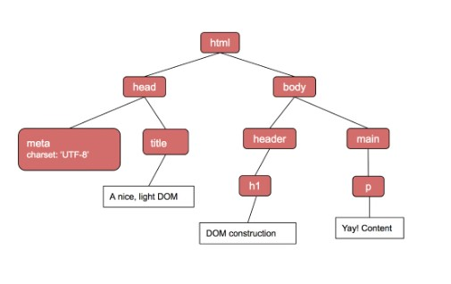
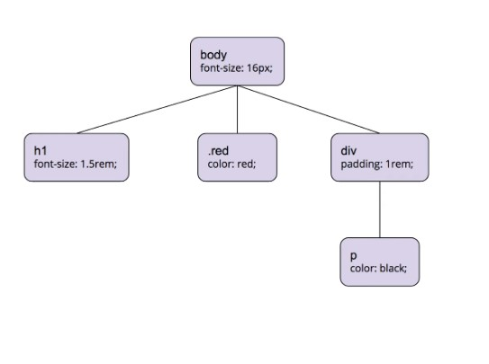
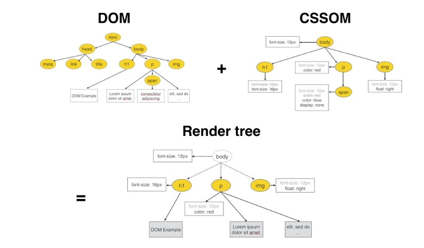

# Magic behind the Browsers 💫

Every day when you open up the browser and navigate to one of our favourite websites we may feel excited because when we think about it we can see that the content/data which we see right in front of our eyes can be from anywhere in the world and it still is in a structured organized manner.

So here we will look at what happens when a user enters an URL in the browser and how the browser fetches the desired result.

## Languages used to communicate with web browsers

Before we dive deep let us see the language used to communicate with the browsers.

- **The HyperText Markup Language or HTML** is the standard markup language for documents designed to be displayed in a web browser. It can be assisted by technologies such as Cascading Style Sheets and scripting languages such as JavaScript.

- **CSS or Cascading Style Sheets** is a style sheet language used for describing the presentation of a document written in a markup language such as HTML.

- **Javascript** is a programming language and it can make our web content more dynamic and interactive.

## What happens when you type a URL into your browser?

#### These are steps that a browser will go through when you press enter after typing in the URL:

1. Look up the location of the server hosting the website
2. Make the connection to the server
3. Send a request to get the specific page
4. Handle the response from the server
5. It will render the page so you, the viewer, can interact with the website

### Let us look at an example step by step:

**Step 1:** An URL is entered into your browser

```
https://www.pesto.tech/become-a-developer
```

The browser will be able to break this URL into 3 parts

- Scheme

  - **https://** is the scheme. HTTPS stands for Hypertext Transfer Protocol Secure. This scheme tells the browser to make a connection to the server using Transport Layer Security, or TLS. TLS is an encryption protocol to secure communications over the Internet. With HTTPS, the data exchanged between your browser and the server, like passwords or credit card info, is encrypted.

- Domain

  - **www.pesto.tech** is the domain name of the site. It is a memorable address and points to a specific server’s IP address. We will get the IP address from ISP's DNS server

- Path and Resource
  - The rest of the URL after **/** is the path on the server to the requested resource

**Step 2:** Now with the help of the IP address (domain), browser will be able to find the location of the host server.

**Step 3:** Now browser initiates TCP connection with the server. if HTTPS is being used, a TLS handshake takes place to secure the communication.

**Step 4:** Now that the browser has a connection to the server, it follows the rules of communication for the HTTP(s) protocol. It starts with the browser sending an HTTP request to the server to request the contents of the page. The HTTP request contains a request line, headers (or metadata about the request), and a body. The request line contains information that the server can use to determine what the client (in this case, your browser) wants to do.

The request line contains the following:

- A request method, which is one of GET, POST, PUT, PATCH, DELETE etc
- The path, pointing to the requested resources
- The HTTP version to communicate with

**Step 5:** Now server will processes the request and then it will get the content at the path , constructs the response and sends it back to the client. The response contains the following:

- A status line, telling the client the status of the request
- Response headers, telling the browser how to handle the response
- The requested resource at that path, either content like HTML, CSS, Javascript, or image files, or data.

The browser considers a **status code** in the **200** to be successful. The response was 200, so the browser knows to render the response.

**Step 6:** At this step browser have the data and it will start rendering the content.

The data, which is returned from the server is in binary stream format. It will have a response header **Content-Type** set to the value **text/html; charset=UTF-8** . Here **text/html** is a Midia Type which tells the browser that it is an HTML document and charset=UTF-8 tells the browser that it is encoded in **UTF-8 character** encoding. Now the file will be in readable format.

### Document Object Model (DOM)

    When the browser reads HTML code, whenever it encounters an HTML element like html, body, div etc., it creates a JavaScript object called a Node. Eventually, all HTML elements will be converted to JavaScript objects.After the browser has created Nodes from the HTML document, it has to create a tree-like structure of these node objects. Since our HTML elements in the HTML file are nested inside each other, the browser needs to replicate that but using Node objects it has previously created. This will help the browser efficiently render and manage the webpage throughout its lifecycle.



### CSS Object Model (CSSOM)

    After constructing the DOM, the browser reads CSS from all the sources (external, embedded, inline, user-agent, etc.) and construct a CSSOM. CSSOM stands for CSS Object Model which is a Tree Like structure just like DOM.



### Render Tree

    Render-Tree is also a tree-like structure constructed by combining DOM and CSSOM trees together. The browser has to calculate the layout of each visible element and paint them on the screen, for that browser uses this Render-Tree.



- Rendering Sequence

  When a web page is loaded, the browser first reads the HTML text and constructs DOM Tree from it. Then it processes the CSS whether that is inline, embedded, or external CSS and constructs the CSSOM Tree from it. <br> After these trees are constructed, then it constructs the Render-Tree from it. Once the Render-Tree is constructed, then the browser starts the printing individual elements on the screen.

- Layout operation

  The first browser creates the layout of each individual Render-Tree node. The layout consists of the size of each node in pixels and where (position) it will be printed on the screen. This process is called layout since the browser is calculating the layout information of each node.

- Paint operation
  Until now we have a list of geometries that need to be printed on the screen. Since elements (or a sub-tree) in the Render-Tree can overlap each other and they can have CSS properties that make them frequently change the look, position, or geometry (such as animations), the browser creates a layer for it.<br>
  Creating layers helps the browser efficiently perform painting operations throughout the lifecycle of a web page such as while scrolling or resizing the browser window. Having layers also help the browser correctly draw elements in the stacking order (along the z-axis) as they were intended by the developer.<br>
  Now that we have layers, we can combine them and draw them on the screen. But the browser does not draw all the layers in a single go. Each layer is drawn separately first.

The job of creating DOM Tree, CSSOM Tree, and handle rendering logic is done using a piece of software called a **Browser Engine** (also known as **Rendering Engine** or **Layout Engine**) which resides inside the browser.

- Parsing and External Resources

  Parsing is the process of reading HTML content and constructing a DOM tree from it. Hence the process is also called DOM parsing and the program that does that is called the DOM parser. When the browser request for a webpage and server responds with some HTML text (with Content-Type header set to text/html), a browser may start parsing the HTML as soon as a few characters or lines of the entire document are available. Hence the browser can build the DOM tree incrementally, one node at a time. The browser parses HTML from top to bottom and not anywhere in the middle since the HTML represents a nested tree-like structure.

> The browser exposes DOM API to the JavaScript runtime, which means we can access and manipulate DOM elements from the JavaScript.

- Below are some of the other features of web browsers

  - The main task is to collect information from the Internet and make it accessible to users.
  - A web browser can be used to visit any website. When we type a URL into a browser, the web server redirects us to that website.
  - Plugins are available on the web browser to run Java applets and flash content.
  - It simplifies Internet surfing because once we arrive at a website, we can quickly check the hyperlinks and access a wealth of information.
  - Internal cache is used by browsers and is saved so that the user can open the same webpage multiple times without losing any data.
  - A web browser can open multiple web pages at the same time.
  - Back, forward, reload, stop reload, home, and other options are available on these web browsers, making them simple and convenient to use.
